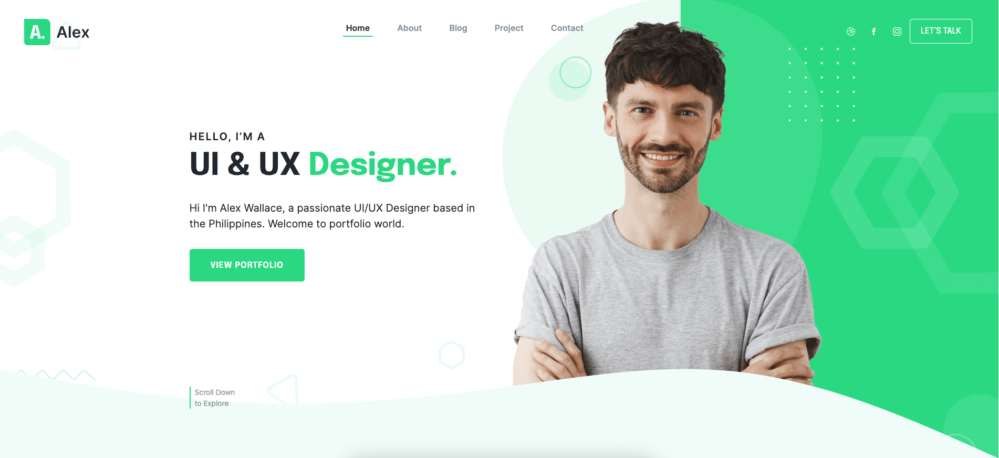

# Alex - Personal Portfolio Bootstrap 5 Template



> Alex is a beautiful landing page template for a portfolio website, It has many pages including, services, about, contact, portfolio, portfolio details, blog, blog details, and more.

Check the [Live Demo here](https://alex-portfolio-template.netlify.app/).


## [Vvveb CMS](https://www.vvveb.com) theme.

👉🏻 [Theme page](https://themes.vvveb.com/product/alex) 
👉🏻 [Theme development documentation](http://dev.vvveb.com/theme-introduction)

Use this template either as a standalone Bootstrap 5 template or as a Vvveb CMS theme.

<!-- download -->
## Download And installation

Download this template from [Github](https://github.com/Vvveb/alex/archive/main.zip)


## Build

### Generate html files

```bash
npm run gulp
```

### Watch for changes for development

```bash
npm run gulp watch
```

### Generate sections list for VvvebJs page builder

```bash
npm run gulp sections
```

### Generate screenshots for sections

```bash
npm run gulp screenshots
```


## Quick start

- Clone the repo and run it.
```bash
git clone https://github.com/Vvveb/alex/
cd alex
npm i
npm run gulp
```


## Framework & Technologies
- [bootstrap5](https://getbootstrap.com/docs/5.3/getting-started/introduction/)
- [isotope-layout](https://isotope.metafizzy.co/)
- [scss](https://sass-lang.com/)

## Credits
Design & Developed by [Templatecookie](https://templatecookie.com)


## License
The MIT License (MIT). Please see [License File](LICENSE.md) for more information.

**Vvveb CMS integration** Changes released under the MIT license.
